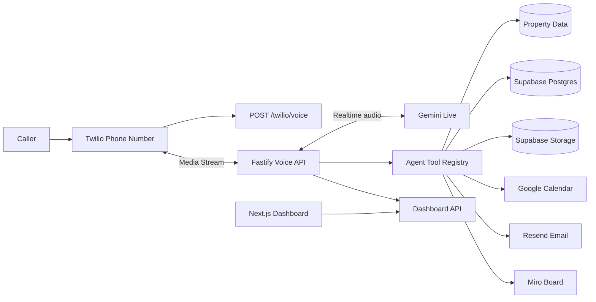

# Waxwing Voice Pro

Waxwing Voice Pro is a 24/7 AI leasing assistant for property managers. It answers real phone calls, identifies the property a caller is asking about, answers property-specific questions, qualifies rental interest, books showings, sends follow-up emails, logs the full call, and creates visual Miro summaries for client review.

It is built for small and mid-sized property management teams that miss calls or spend too much time on repetitive leasing conversations. In the demo workflow, the agent does real operational work instead of only answering questions.

## Quick Start

```bash
npm install
cp .env.example .env
npm run build:all
npm test
```

Run the API locally:

```bash
npm run dev
```

Run the dashboard locally:

```bash
npm run dev:web
```

Local URLs:

- API: `http://localhost:8787`
- Dashboard: `http://localhost:3000`
- API health check: `http://localhost:8787/health`

For a live phone demo, the API must be deployed to a public HTTPS domain because Twilio needs to reach the voice webhook and WebSocket media stream.

## Tech Stack

- **Voice and phone:** Twilio Voice + Twilio Media Streams
- **Realtime AI voice:** Gemini Live
- **Backend:** Node.js, TypeScript, Fastify, WebSockets
- **Frontend:** Next.js dashboard
- **Database and storage:** Supabase Postgres + Supabase Storage
- **Email:** Resend
- **Scheduling:** Google Calendar OAuth and Calendar API
- **Visual workflow:** Miro API
- **Shared business logic:** local TypeScript packages for property matching, qualification, compliance guardrails, prompts, and call state

## Architecture



The agent receives a caller goal, tracks call state, decides what information is missing, calls backend tools, and produces useful outputs: a booked showing, a structured lead record, a transcript, a recording, a post-call email, and a Miro summary.

More detail is in [docs/architecture.md](docs/architecture.md).

## Reproduce The Demo

1. Create the `.env` file:

   ```bash
   cp .env.example .env
   ```

2. Fill the required environment variables.

   ```env
   # App
   API_BASE_URL=https://your-api-domain.com
   APP_BASE_URL=https://your-dashboard-domain.com
   DASHBOARD_API_KEY=replace-with-random-secret
   ENCRYPTION_KEY=replace-with-32-byte-base64-key
   SESSION_SECRET=replace-with-32-plus-random-chars

   # Gemini Live
   GEMINI_API_KEY=
   GEMINI_LIVE_MODEL=gemini-2.5-flash-live-preview

   # Twilio
   TWILIO_ACCOUNT_SID=
   TWILIO_AUTH_TOKEN=
   TWILIO_PHONE_NUMBER=
   TWILIO_WEBHOOK_BASE_URL=https://your-api-domain.com

   # Supabase
   SUPABASE_URL=
   SUPABASE_SERVICE_ROLE_KEY=
   SUPABASE_STORAGE_BUCKET=call-artifacts

   # Resend
   RESEND_API_KEY=
   RESEND_FROM_EMAIL="Morgan Leasing <calls@yourdomain.com>"
   RESEND_REPLY_TO=leasing@yourdomain.com

   # Google Calendar
   GOOGLE_OAUTH_CLIENT_ID=
   GOOGLE_OAUTH_CLIENT_SECRET=
   GOOGLE_REDIRECT_URI=https://your-api-domain.com/google/oauth/callback

   # Optional Miro
   MIRO_CLIENT_ID=
   MIRO_CLIENT_SECRET=
   MIRO_REDIRECT_URI=https://your-api-domain.com/miro/oauth/callback
   MIRO_DEFAULT_BOARD_ID=
   MIRO_ACCESS_TOKEN=
   MIRO_REFRESH_TOKEN=
   ```

3. Apply Supabase migrations and seed data.

   Run the SQL files in `supabase/migrations` and `supabase/seed.sql` in the Supabase SQL editor, or use the Supabase CLI if configured.

4. Create a private Supabase Storage bucket named:

   ```text
   call-artifacts
   ```

5. Connect Twilio.

   Set your Twilio number voice webhook to:

   ```text
   POST https://your-api-domain.com/twilio/voice
   ```

6. Connect Google Calendar.

   Visit the deployed OAuth start route, sign in as the calendar owner, and approve the requested scopes. The app stores the calendar connection in Supabase.

7. Optional: connect Miro.

   Add Miro OAuth credentials and board id, then visit the Miro OAuth start route. Post-call summaries can then be exported to the configured board.

8. Run the demo.

   Call the Twilio number, ask about a seeded property, ask to schedule a showing, answer the qualification questions, and provide name, phone, email, move-in date, and lease length. After the call, open the dashboard and show the call detail page, recording, transcript, captured fields, calendar view, email, and Miro export.

Credential-by-credential setup instructions are in [docs/secrets-setup.md](docs/secrets-setup.md).

## Synthetic Data And Provenance

The demo uses synthetic property-management data. No real tenant applications, private renter records, or protected-class data are included.

Seed data lives in:

- [supabase/seed.sql](supabase/seed.sql)

The seeded properties are mock Texas rental listings originally drafted for the demo call flow. They include fields such as street address, city, bed and bath count, monthly rent, pet policy, availability date, and application URL. The data is synthetic and manually created for product demonstration.

Synthetic caller examples used during demos are also fictional. Example names, phone numbers, emails, move-in dates, and qualification answers should not be treated as real customer data.

## Known Limitations

- SMS follow-up is intentionally not included yet.
- The current demo assumes one default client slug unless additional client onboarding is configured.
- The dashboard is functional, but advanced analytics such as trends, cohort analysis, and conversion attribution are future work.
- Calendar booking depends on a valid Google Calendar OAuth connection.
- Miro export depends on a configured board and access token.
- The call audio mixer creates a single conversation WAV for new calls, but older recordings are not automatically regenerated.
- Production-grade retry queues should be added for email, calendar, and Miro jobs before higher-volume usage.
- Twilio signature validation and stricter operational monitoring should be hardened before a real customer launch.

## Next Steps

- Add SMS confirmation and follow-up.
- Add multi-client onboarding in the dashboard.
- Add CRM integrations for property managers.
- Add richer lead scoring and leasing analytics.
- Add a durable background job queue for post-call work.
- Add stronger admin permissions and client-specific dashboard users.
- Add better observability with Sentry or another error-tracking system.

## Render Deployment

Deploy the realtime voice API and dashboard as separate Render Web Services.

Voice API service:

- Build command: `npm install && npm run build`
- Start command: `npm start`
- Health check path: `/health`

Dashboard service:

- Build command: `npm install && npm run build:web`
- Start command: `npm run start:web`
- Health check path: `/`
- Environment variables:
  - `API_BASE_URL=https://your-api-domain.com`
  - `DASHBOARD_CLIENT_SLUG=default`
  - `DASHBOARD_API_KEY=<same value as the API service, if enabled>`

The root production build is API-only because Twilio Media Streams need the Fastify WebSocket service. The dashboard is a separate Next.js service that server-fetches the API dashboard endpoints.
