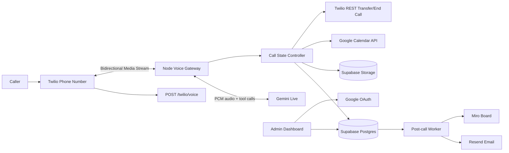

# Architecture

## Overview

This project is a TypeScript monorepo with separate packages for the voice API, admin dashboard, shared domain logic, and database/storage access.

## Packages

- `apps/api`: Fastify API, Twilio webhooks, Twilio Media Stream WebSocket, Gemini Live adapter, provider adapters, post-call worker.
- `apps/web`: Next.js admin dashboard shell.
- `packages/core`: property matching, qualification, fair-housing guardrails, call state, prompt text, shared types.
- `packages/db`: Supabase repository and storage adapters.
- `supabase/migrations`: database schema.
- `docs`: project documentation and operations guides.

## Live Call Flow

1. Caller dials the Twilio phone number.
2. Twilio requests `POST /twilio/voice`.
3. API returns TwiML with `<Connect><Stream>` to `/twilio/media`.
4. Twilio streams inbound caller audio as base64 `audio/x-mulaw` at 8 kHz.
5. The voice gateway stores inbound raw audio chunks.
6. The voice gateway decodes mu-law audio, upsamples to 16 kHz PCM, and sends audio to Gemini Live.
7. Gemini returns 24 kHz PCM audio and tool calls.
8. The gateway downsamples Gemini audio to 8 kHz mu-law and streams it back to Twilio.
9. The gateway stores outbound raw audio chunks.
10. Tool calls go through the deterministic backend tool registry.
11. At call end, the gateway stores audio artifacts, transcript, summary, structured values, and final outcome.
12. The post-call worker sends email and syncs Miro.

## Storage Model

Postgres stores:

- Client configuration.
- Property catalog.
- Google Calendar connections.
- Calls and call events.
- Transcript turns.
- Captured lead values.
- Qualification results.
- Showing records.
- Email delivery records.
- Miro export records.
- Audit logs.

Supabase Storage stores:

- `calls/{callId}/audio/inbound.raw.ulaw`
- `calls/{callId}/audio/outbound.raw.ulaw`
- `calls/{callId}/audio/metadata.json`
- Future transcript or summary exports if needed.

Raw audio links must be signed/private links, not public object URLs.

## Provider Boundaries

Each external service has a focused adapter:

- Gemini Live: real-time speech-to-speech session and tool-call handling.
- Twilio: live call transfer and hangup.
- Google Calendar: OAuth, free/busy, event creation.
- Resend: post-call email.
- Miro: lead sticky/card creation.
- Supabase: database and artifact storage.

Adapters are intentionally thin. Business rules stay in `packages/core` and the call controller.

## Scaling Notes

- The WebSocket gateway should run in a region close to Twilio and Gemini endpoints.
- Use horizontal API replicas, but keep each active call pinned to one WebSocket process.
- Store all important state as events and snapshots so interrupted calls can still be audited.
- Move post-call work to `pg-boss` or another durable queue before production volume.
- Add a retry policy for Resend, Miro, and Calendar jobs.
- Add Sentry or another error tracker before launch.

## Security Notes

- Do not expose the Supabase service role key to the browser.
- Do not store raw OAuth refresh tokens. Encrypt them with `ENCRYPTION_KEY`.
- Validate Twilio signatures before production launch.
- Keep raw audio private and use expiring signed URLs.
- Avoid storing protected-class information as lead data.
